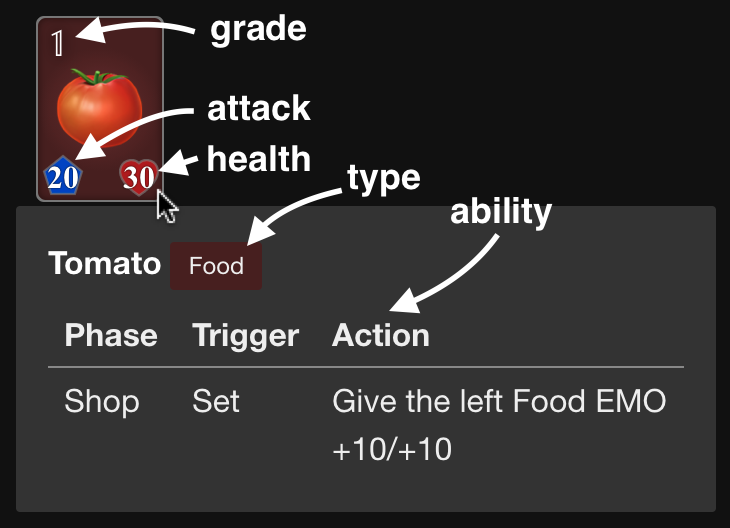
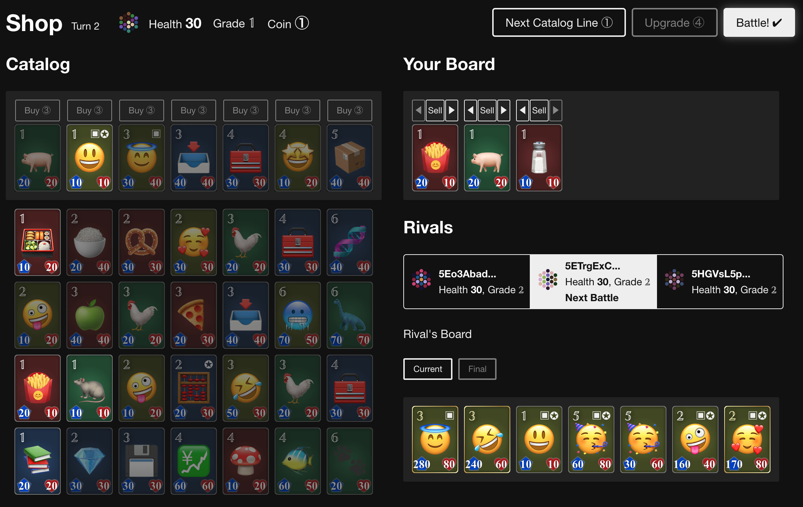

# Gameplay Guide

If you're new to the Open Emoji Battler project, please start by checking out [this page](https://openemojibattler.github.io/open-emoji-battler/introduction) first.

## Getting Started

The game works on web browsers. To start playing the game, please visit [the website](https://game.open-emoji-battler.community).

Once there, you can explore the game by clicking on the "Try" button, which doesn't require any setup. We encourage you to do this first to familiarize yourself with how the game works.

To save your progress and change your deck, you need to install [the Polkadot{.js} extension](https://polkadot.js.org/extension/) and set up your account. Also, if you're connected to Shiden Network, a small amount of SDN is necessary to cover transaction fees. Just 1 SDN is enough for dozens of matches.

## Game Objective and Overview

In this game, your primary goal is to increase your EP (Emoji Power) by competing in matches. EP functions like a rating system for players and is also used for matchmaking. When you win a match, your EP increases.

During a match, you employ emojis called EMOs and battle with three rivals. These rivals are chosen from past gameplay data, eliminating the need to wait for other players to start the game. Your aim is to defeat your rivals and achieve a high rank within the game.

## Understanding EMO

EMOs are emoji units that fight for players. You can see the detail on mouseover.

- Grade: 1 to 6
- Type: Human, Nature, Food, Object

## Match Flow

Here's how a match proceeds. Detailed explanations of each step will be provided in the subsequent sections.

1. Build your EMO deck.
2. Start a match and three rivals will be presented.
3. Take turns consisting of Shop and Battle phases.
	- Shop: Strengthen your board. Use Coins to buy and sell EMOs or upgrade your player grade.
	- Battle: Watch the auto-battle. EMOs on the boards automatically attack the opponent's EMOs until one side loses all EMOs. The winner deals damage to the opponent's health.
4. The match concludes when you are the last one standing or your health reaches 0.
5. Your EP gets updated based on this match result.

## Preparation

Before starting a match, you can select or build an EMO deck. Each deck consists of six EMOs for every grade. During the match, your deck is combined with pre-defined EMOs to create an EMO pool. The count of each EMO is multiplied in this pool.

When you're ready, press the start button to begin the match. The first phase is the Shop phase.

Your rivals are selected automatically based on your EP. You start with an initial health of 30.

## Shop Phase

At the beginning of this phase, you get a certain number of Coins. The amount of Coins you receive starts at 3 on the first turn and increases by 1 each turn, up to a maximum of 8. Note that unused Coins within a phase are not carried over to the next turn.

During this phase, you can take the following actions:

- Spend 3 Coins to buy an EMO from the top line of the Catalog.
	- EMOs in the Catalog are randomly chosen from the pool.
	- Click the "Buy" button to select an EMO and decide its position on your board.
	- Keep in mind that you cannot buy an EMO with a higher grade than your player grade.
- Spend 1 Coin to advance to the next Catalog line.
	- Exceptionally on the first turn, you can do this twice for free.
- Spend Coins to upgrade your player grade.
	- The amount of Coins required to upgrade varies based on the grade and decreases by 1 on each turn.
- Reposition an EMO on your board for free.
- Sell an EMO from your board and receive 1 Coin.

You can also view the status of your rivals.

When you have three EMOs of the same emoji on your board, they merge into a powerful Triple EMO with enhanced stats and abilities, and you are rewarded with 5 Coins.

Once you have completed all your actions, you can proceed to the Battle phase.

## Battle Phase

The battle automatically begins with one of your rivals. The player with a greater number of EMOs attacks first. If the numbers of EMOs are equal, the attack order is determined randomly.

EMOs take turns attacking a randomly chosen EMO from the opponent's side. This starts from the leftmost EMO and moves to the right.

An EMO is considered "retired" when its health reaches 0.

A player loses the battle when all of their EMOs have retired. The winner then deals damage to the defeated player's health. The amount of damage dealt equals the sum of the winner's player grade and the grades of their remaining EMOs on the board.

After the battle, the next Shop phase starts. Any changes made to the boards during the battle will be reset. A set consisting of one Shop phase and one Battle phase is referred to as a turn.

The match finishes when all of your rivals or you have retired.

## Result

At the end of a match, you'll see your rank and how your EP has changed.

## Notes

- You can watch [this gameplay video](https://www.youtube.com/watch?v=ah3-sWMATSM) to get a hint.
- Do not reload the site during gameplay. You won't be able to resume the match, and it will be considered a loss.
- Do not reject the transaction signing popup from the extension. Similarly to the point above, you can't resume the game. We aim to improve this behavior in future versions.

## Winning Tips

- Strategies for each EMO type: https://forum.open-emoji-battler.community/t/topic/45
- A guide for Japanese readers: https://news.blockchaingame.jp/1895
