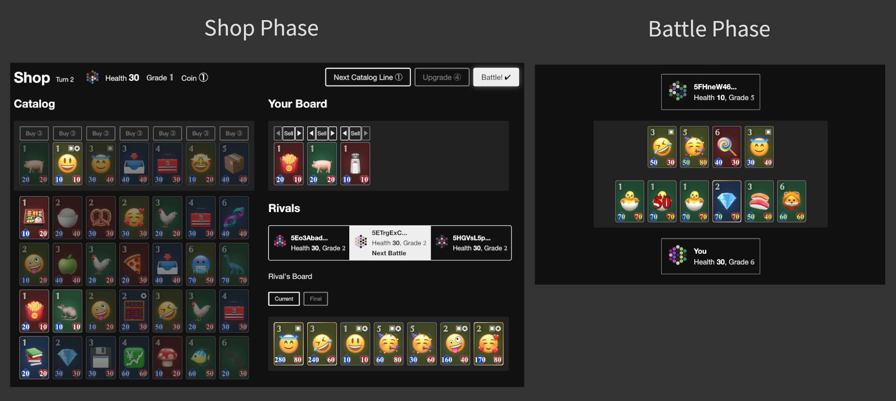
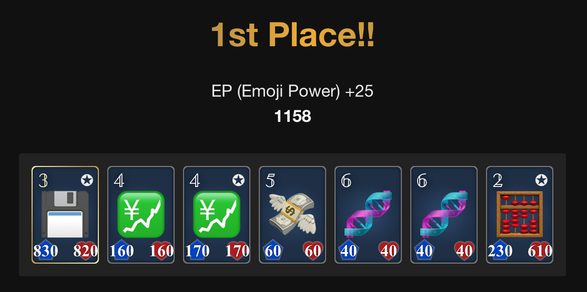

Open Emoji Battler is a decentralized multiplayer game, and also a game development project. This project is owned and governed by the community. The entire game runs directly on blockchains, and its codebase is open-source. In the game, players battle in fun and strategic matches with their emoji units. The playable prototype is available.

https://user-images.githubusercontent.com/81064017/177928297-7a75fa42-361c-48d8-b361-79a1ecad0eb1.mp4

# Decentralization

In traditional online games, the owner company has full rights and control over the game. They operate the game commercially with a top-down approach. Their private software runs on centralized servers, and access is restricted. Players have to trust the company for future service and changes because there's not much they can do by themselves.

This situation applies to most blockchain games today as well. They introduce some NFT/FT into Web2 games, but still, the games heavily rely on central entities and servers. The newly added asset ownership and open market were a revolution, but the utility of assets is tied with the controlled games, which can be lost in the future.

Remember that one of the most intrinsic values of blockchain is that not depend on trusted central entities. Open Emoji Battler values this concept, so our vision is to build a truly decentralized and unstoppable game. This is only possible with the novel blockchain technology. With this in mind, we structured this project; the source code and content are free and open, the execution engine is permissionless and persistent, and the governance is open to the community.

Developing a decentralized game is complex because of technical difficulties. All important actions must be processed in a trustless manner, so the game design isn't flexible, and UX could be a hurdle. Not only the technical aspect, but traditional business models also are not viable. That's a big challenge for builders, but it's certainly worth building a decentralized game by exploring the full power of blockchain technology.

We're not a company and don't have a CEO or management team. Open Emoji Battler is a community project made by its contributors. Gamers build and govern this project as a metagame.

# Sustainability and gameplay

We thought carefully about the gameplay sustainability from the beginning. Some Play-to-Earn models that keep printing coins can attract players, and it's great for the initial marketing, but it isn't easy to run over the long term. At Open Emoji Battler, we design simple yet fun skilled-gameplay first under the technical limitations, and it should be worth playing without monetary benefit - have fun.

Moreover, this project does not aim to become GameFi or gamified wrapper of DeFi. We also have some economic incentives for the community, and it'd be great if we could see pro gamers on the game, but it's not built for making money. Games are originally for enjoyment.

# Technology

This project is built in the Polkadot ecosystem. The advantages of this ecosystem are not only the cross-chain interoperability and flexibility but also the Wasm use. Thanks to its efficient platform-agnostic format, our source code, which is written in Rust language, can be compiled into Wasm and used in smart contracts, blockchain runtime, and web frontend.

As mentioned above, our game logic is fully on-chain. There are no traditional servers. Whatever decentralized architecture is fine for our goal, but we chose the direct on-chain execution architecture because it's simple and mature. The reason why we have two different on-chain implementations (chain and contracts) can be read on [this page](https://forum.open-emoji-battler.community/t/topic/55).

The UI of this game is a web frontend usable on browsers, but it should be client-agnostic. Some blockchain game titles offer rich graphics with game engines like Unreal Engine or Unity, but these engines are non-free or closed proprietary software, so they can't be our options. We use open and plain web technologies, and the frontend can be on IPFS.

Our NFT collection is on Statemine. Statemine is a parachain for assets in the ecosystem. It is the first fully on-chain, ecosystem native NFTs on the whole Statemine and Statemint. They will be used in the game and governance. You can learn more here:
https://forum.open-emoji-battler.community/t/topic/58

All source code is [available on GitHub](https://github.com/OpenEmojiBattler/open-emoji-battler).

# Current status

Since the soft launch, this project has received a lot of support from the community. Thank you! We currently have playable prototypes on a smart-contract testnet and our own chain, and the initial NFTs are distributed. Also, we're receiving rewards from Shiden dApp staking. We're working hard for the mainnet release.

Here is our brief history. This project was started by @tash_2s as a small indie development with the vision above and revealed in 2021. Emoji was chosen for a game unit theme because emojis are just character data, so they're easily put on a chain freely, and there is enough amount of emojis for various game units. Unlike projects rushing sales without much gameplay info, we have a working prototype from day one because the gameplay is essential for our game. It was initially built as an independent blockchain, but now our focus is on a smart-contract version. We joined the Shiden Builders Program since Shiden parachain supports Wasm contracts, and we're accumulating its dApp staking rewards into our treasury. Recently, we airdropped NFTs to the community fairly.

# Core game mechanics

This is a competitive strategy game inspired by popular auto-battler games. Players fight in four-player matches asynchronously to increase their ratings. Emoji units that fight for players are called EMOs.

First, you build your EMO deck. Then, a match starts, and you face three opponent players. Your goal in this match is to defeat the opponents by damaging their health points while keeping your health alive. The match progresses in repeated sets of two phases: a shop phase and a battle phase. In shop phases, you assemble and upgrade your board (field) by buying and selling EMOs at the shop. In battle phases, you face off one random opponent, and your EMOs automatically attack the opponent EMOs without input. When one loses all EMOs, the lost player takes damage. Then, the next shop phase starts. The match ends when there's only one player alive. Lastly, your rating gets updated, reflecting the match result.

You can learn more about how to play below:
https://forum.open-emoji-battler.community/t/topic/17

# Roadmap

Our planned milestones and features, in no particular order:

- Gameplay 🕹️
	- **Event round**: The first event round with prizes will be held on Shiden.
	- **Seasonal leaderboard**: Players compete in specified time windows.
	- **Real-time match**: In addition to the current asynchronous PvP, players play a match at the same time.
	- **Custom match**: Players start private configurable matches with friends.
	- **Dynamic EMO pool**: In each match, the EMO pool gets affected by opponents and other various factors. For example, the same EMOs used on opponents' boards are reduced, making it difficult to build the same type of board.
	- Rewards
- EMO 😶
	- **Original/Replica EMOs**: Original EMO = EMO NFT. Both EMOs can be built into decks. Replica EMOs are in-game, non-transferable EMOs and could be weaker a little compared to the Original. Players get Replica EMOs through gameplay.
	- **EMO fusing**: Players merge multiple EMOs into one to get a higher attack/health EMO.
	- New EMOs and abilities
- Others 🏗️
	- Governance and decentralization
	- Tutorial and guide
	- Growth and marketing
	- Graphics/UI/UX upgrade

These plans are subject to change.

# Outro

Open Emoji Battler is a unique project; it has a different philosophy from usual blockchain games. We are only at the beginning of creating a decentralized game. It's not perfect, but we continue to improve. If you're interested in this project, join us!

- [Website](https://game.open-emoji-battler.community)
- [Twitter](https://twitter.com/OEB_community)
- [Discord](https://discord.gg/fvXzW8hFQ7)
- [Forum](https://forum.open-emoji-battler.community)
- [GitHub](https://github.com/OpenEmojiBattler/open-emoji-battler)
