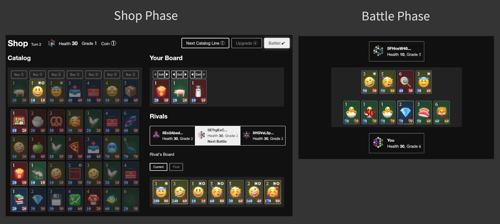
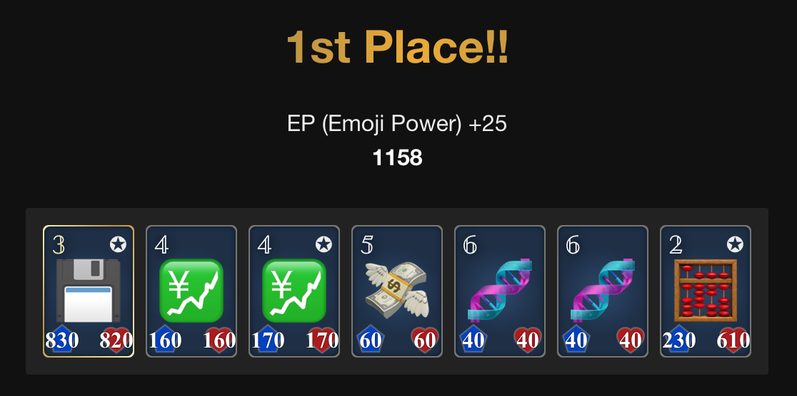

# Welcome to Open Emoji Battler

[Open Emoji Battler](https://game.open-emoji-battler.community) is a decentralized multiplayer game owned by the community. Conceived with a vision of developing an open and free gaming experience, the entire game runs on blockchains, with a fully open-source codebase. Our game offers players fun and strategic battles where they can deploy their emoji units and challenge others.

This page will provide an introduction to the Open Emoji Battler project.

<video src="assets/demo.mp4" controls width="640"></video>

## Decentralization

Contrary to normal online games (and most blockchain games as of today), where the owning companies have full control and rights, Open Emoji Battler aims to build a truly decentralized and unstoppable game. Traditional games are run by a top-down, centralized approach, and as a result, players depend on the developer companies for future updates and policies.

However, Open Emoji Battler operates under the community, staying true to the essence of blockchain - eliminating dependence on trusted central entities. By leveraging blockchain technology, we have created a crypto-native game where the source code and content are free, the execution engine is permissionless, and the governance is open to the community.

Open Emoji Battler is not governed by a CEO or management team. Instead, it thrives as a community project, made by gamers, for gamers.

## Gameplay Sustainability

At Open Emoji Battler, we have always prioritized sustainable gameplay. We focus on designing simple yet intriguing skilled gameplay that doesn't need to keep printing coins to attract players. While we have integrated some economic incentives for our community, our project does not aim to become a GameFi or a gamified wrapper of DeFi. At its core, Open Emoji Battler is about fun, not monetary gains.

## Technology

This project is built within the Polkadot ecosystem. The advantages of this ecosystem not only include cross-chain interoperability and flexibility but also the use of Wasm. Thanks to its efficient platform-agnostic format, our source code, written in the Rust language, is compiled into Wasm, enabling its use in smart contracts, blockchain runtime, and the web frontend.

The game logic is fully on-chain to process actions in a trustless manner. We've chosen the direct on-chain execution architecture for its simplicity and maturity. We have a web frontend that can be hosted on IPFS for the game's UI. We're committed to open technology, so proprietary or non-free software / game engines aren't viable options for us.

Our NFT collection resides on Statemine, a parachain designed for assets in the Polkadot ecosystem. This collection represents the first fully on-chain, ecosystem-native NFTs on both Statemine and Statemint.

## Milestones Achieved

- We had a playable prototype from [day one](https://polkaverse.com/@openemojibattler/announcing-substrate-game-open-emoji-battler-10178) because we believe in the importance of gameplay. This has evolved into [two on-chain implementations](https://forum.open-emoji-battler.community/t/topic/55): a blockchain and a smart contract.
- We have fairly [distributed NFTs](https://forum.open-emoji-battler.community/t/topic/58) to our community. We've never held any sales or similar activities.
- We've [hosted a gameplay event](https://forum.open-emoji-battler.community/t/topic/63) with prizes. The top players on the leaderboard were awarded cryptocurrency and NFTs in the open and free-to-play event.

## Core Game Mechanics

Inspired by popular auto-battler games, Open Emoji Battler offers competitive strategy gameplay. Players engage in four-player matches asynchronously to increase their ratings. The emoji units, referred to as EMOs, battle on behalf of the players.

A match begins with the player building an EMO deck, followed by facing off against three opponent players. The goal is to defeat opponents by reducing their health points while preserving one's own. The match progresses in repeated sets of shop and battle phases. In a shop phase, you build and upgrade your board (field) by buying and selling EMOs. In a battle phase, you face off against one random opponent, and your EMOs automatically attack the opponent EMOs. When one loses all EMOs, the lost player takes damage. Then, the next shop phase starts. The match concludes when only one player remains. Lastly, your rating is updated based on the match result.

  

For more insights into gameplay, [visit this guide](https://openemojibattler.github.io/open-emoji-battler/how-to-play).

## Plans

We have a lot of exciting ideas for upgrades!

- **Gameplay**: Real-time matches, custom matches with friends, dynamic EMO pool that changes based on various factors in each match, and rewards.
- **EMO**: Integration of Original/Replica EMOs, new EMOs and abilities, and an EMO fusing feature.
- **Miscellaneous**: Enhancements in governance, decentralization, tutorial and guides, and graphical/UI/UX upgrades.

## Wrapping Up

Open Emoji Battler is more than a game – it's a project with a guiding philosophy that sets it apart from conventional blockchain games. We are only at the beginning of developing a decentralized game, and we hope you're interested in this project.

- [Website](https://game.open-emoji-battler.community)
- [GitHub](https://github.com/OpenEmojiBattler/open-emoji-battler)
- [Twitter](https://twitter.com/OEB_community)
- [Discord](https://discord.gg/fvXzW8hFQ7)
