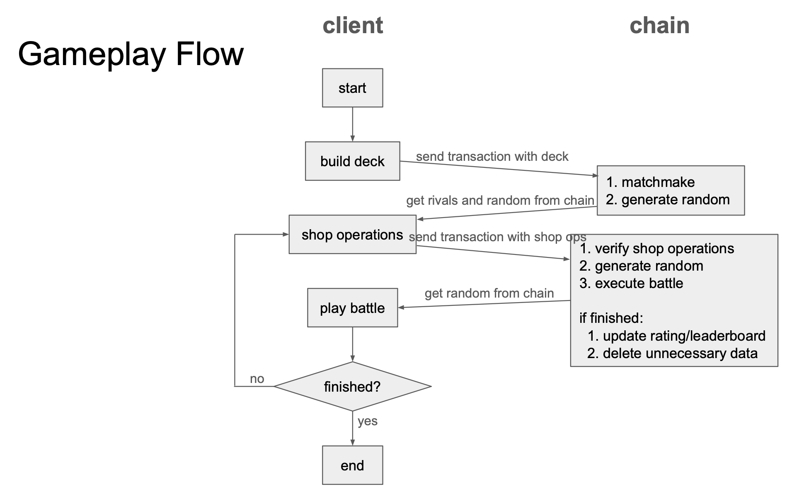

# Technology

## Background and Motivation

In 2019, before initiating this project, I developed [a fully on-chain game for EVM blockchains](https://github.com/tash-2s/onchain-game-2019_archive). Despite successfully building it, I encountered several challenges, including high transaction fees, lengthy block times, UX frictions, and the inherent inefficiencies and complexities of EVM/Solidity. These limitations constrained the game's design, prompting me to seek alternatives outside the EVM ecosystem for my next project, which evolved into Open Emoji Battler.

## Project Overview

Open Emoji Battler is a fully on-chain game developed using Substrate ecosystem technologies and has been operational since 2021. It features more sophisticated and complex gameplay compared to my previous EVM-based project, thanks to its new architecture.

The design goals for this project include:

- **Decentralization and Interoperability**: Achieved with a fully on-chain architecture that eliminates the need for central servers and external indexers. The client interacts solely with the blockchain's RPC endpoint. Even the emojis are stored on-chain as Unicode code points.
- **Optimal Player Experience and Reduced Chain Load**: By minimizing on-chain interactions (both read and write), we reduce player wait times. This is facilitated by implementing the game logic in Rust, compiling it into Wasm, and utilizing it for both the blockchain and the client. The game progresses primarily on the client wherever possible.
- **Avoiding Duplicate Implementation**: A shared Rust codebase for both blockchain and client ensures consistency and reduces development effort. This architecture also simplifies the implementation of a trial mode, where players can try out and practice gameplay without any setup by simply disabling transaction submissions.
- **Client Agnosticism**: This ensures no gameplay advantages through alternative or modified clients by making all critical information and blockchain actions accessible via the client. This approach prevents players from gaining unfair advantages by bypassing the standard client and anticipates the presence of bots by design.

## Implementation

The game was initially developed as a standalone blockchain (AppChain) without using smart contracts but was later adapted for smart contract implementation.

The standalone, independent blockchain, developed using the Substrate framework, boasts unique features:

- **Session Account**: This feature allows players to submit transactions seamlessly using local burner accounts. Typically, a session account requires users to transfer funds from their main account to cover their transaction fees. However, this integrated feature allows the blockchain to use the main account's balance directly to cover the fees for the session account.
- **Free Transactions**: Players can submit transactions for free by solving proof-of-work challenges, which prevents DoS attacks without requiring players to obtain currency in advance.

In contrast, the smart contract implementation lacks these blockchain-level features but can be deployed on any compatible chains.

The smart contract is developed using the `ink!` framework targeted at `pallet-contracts` Wasm VM. Compared to the EVM, this architecture offers:

- 👍 **Greater computational efficiency**: Faster execution and reduced memory usage.
- 👍 **Less storage consumption**: Variable storage entry size, not fixed to 256 bits.
- 👎 **Larger contract bytecode size**: Occupies more storage, often reaching the contract size limit.
    - This is due to EVM/Solidity being specialized for smart contracts, whereas Rust/Wasm is more general.

## Gameplay Flow

The gameplay flow, from the perspectives of both the client and the chain, involves a match consisting of a shop and battle phase loop.

1. Initially, a player builds a deck for a match and submits the first transaction containing the deck data.
2. The chain performs matchmaking, finds rivals (opponents) from storage, and generates a random seed.
3. The client retrieves the rivals and the random seed from the chain. During the shop phase, the player builds his board through several operations. The JavaScript on the client focuses solely on UI updates, while the Wasm code handles the game logic.
4. After the shop phase, the client submits a batch transaction with the shop operations data. The chain verifies these operations by re-executing them, thus building the same board data shown in the client's UI. It then generates a new random seed and executes the auto-battle.
5. The client fetches the new random seed from the chain and plays the auto-battle, achieving the same result using the random seed. The cycle repeats with the next shop phase unless the match concludes.
6. At the match's end, the player's rating and leaderboard positions are updated, and any temporary match data is removed.

## Code Structure

The main directories located at the repository root are as follows:

`common/rs` is the primary implementation for the game logic. It includes a compile-time configurable flag for optimization. The chain and client share the same codebase, although the client version needs detailed information for intuitive UI updates, unlike the chain, which only requires the final outcome. When compiled for the client target, the code is full-featured, capable of generating detailed logs. However, when compiled for the on-chain target, it is stripped down to include only the essentials.
